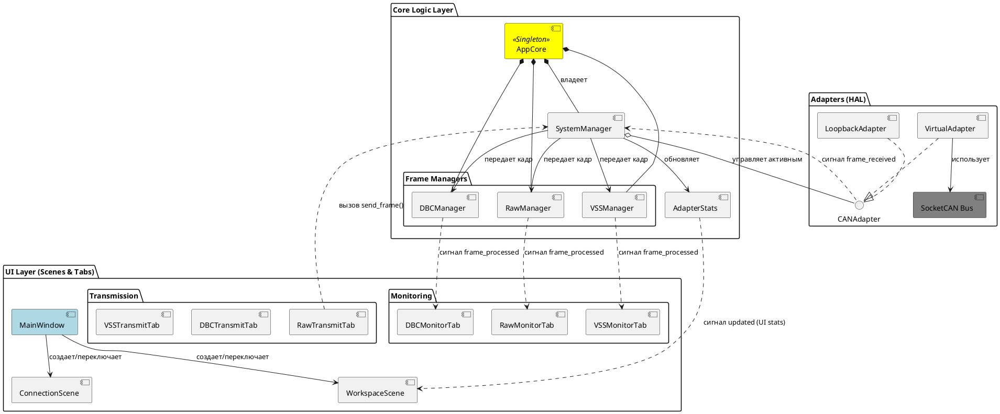
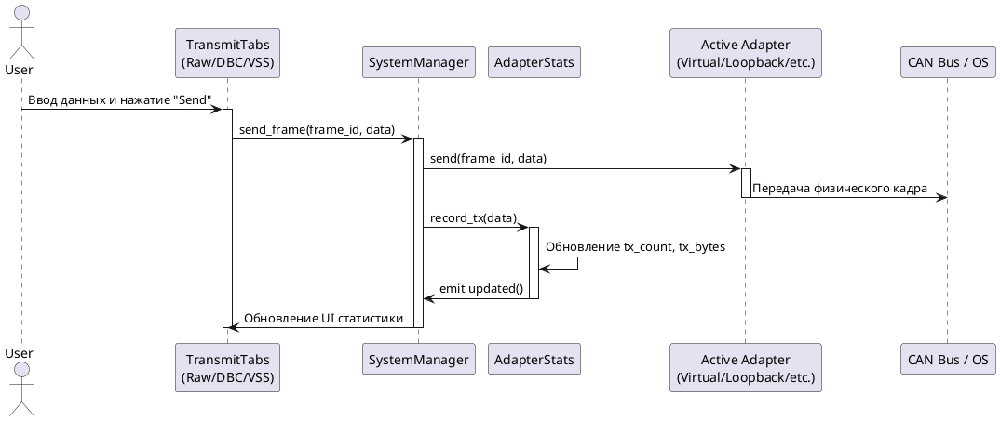
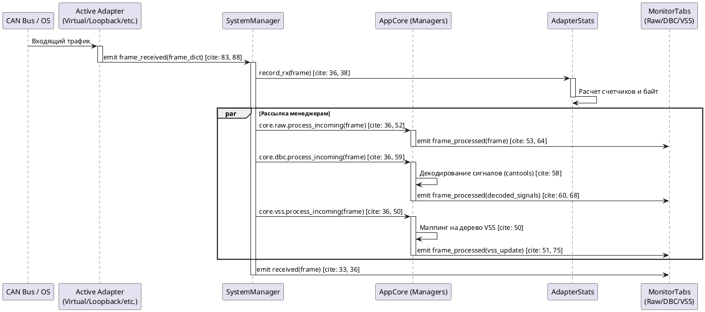

## 1. Общий обзор системы

Проект представляет собой модульное GUI-приложение на базе **PyQt6** для мониторинга и анализа CAN-шины. Архитектура разделена на три основных слоя:

1. **Hardware Abstraction Layer (HAL)** — адаптеры для работы с физическими и виртуальными интерфейсами.
2. **Core Logic** — центральный контроллер (`SystemManager`) и менеджеры обработки данных (`DBC`, `VSS`, `Raw`).
3. **UI Layer** — динамически переключаемые сцены и вкладки мониторинга.

---

## 2. Описание классов по уровням

### 2.1. Уровень адаптеров (adapters/)

Обеспечивает унифицированный интерфейс для разных типов оборудования.

* **`CANAdapter` (Base)**: Абстрактный базовый класс. Определяет сигнал `frame_received(dict)` и методы `connect()`, `disconnect()`, `send()`.

* **`VirtualAdapter`**: Реализация для Linux SocketCAN. Использует библиотеку `python-can` и фоновый поток для чтения.

* **`LoopbackAdapter`**: Отправляет исходящие сообщения обратно в систему для тестирования.

* **`ADAPTER_TYPES`**: Реестр доступных типов и их параметров в `registry.py`.

### 2.2. Уровень ядра (core_logic/)

* **`SystemManager`**: Владеет объектом активного адаптера. Управляет жизненным циклом подключения и распределяет входящие кадры по менеджерам обработки.

* **`AdapterStats`**: Хранит статистику (счетчики кадров и байт, средний размер данных).

* **`AppCore`**: Синглтон, предоставляющий глобальный доступ к менеджерам (`core.dbc`, `core.vss` и т.д.).

### 2.3. Менеджеры кадров (framemanagers/)

* **`RawManager`**: Транслирует необработанные данные во вкладку мониторинга.

* **`DBCManager`**: Использует файлы конфигурации `.dbc` для декодирования ID и данных в именованные сигналы.

* **`VSSManager`**: Маппит данные на древовидную структуру Vehicle Signal Specification.

---

## 3. Процессы передачи и приема данных

### Прием сообщения (RX)

1. Адаптер получает кадр из ОС/железа в фоновом потоке.
2. Генерируется сигнал `frame_received`.
3. `SystemManager` ловит сигнал, записывает статистику в `AdapterStats` и вызывает `process_incoming` у всех активных менеджеров.
4. Менеджеры (DBC/VSS/Raw) обрабатывают данные и рассылают сигналы `frame_processed` соответствующим вкладкам GUI.

### Отправка сообщения (TX)

1. Пользователь нажимает "Send" во вкладке.
2. Вызывается `core.system_manager.send_frame(id, data)`.

3. `SystemManager` вызывает метод `send` у активного адаптера и обновляет TX-статистику.

---

## 4. Диаграммы PlantUML

### Диаграмма компонентов

### Диаграмма отправки кадров (TX Process)

В системе реализовано два пути отправки: Raw Transmit (прямой ввод ID и данных) и перспективные DBC/VSS Transmit (через генераторы сообщений). Все они проходят через единую точку входа в SystemManager.

### Диаграмма получения кадров (RX Process)

При получении кадра система выполняет "обогащение" данных через параллельную рассылку всем зарегистрированным менеджерам.

---

## 5. Инструкции по расширению

### Как добавить новый тип адаптера

1. Создайте класс в папке `adapters/`, унаследовав его от `CANAdapter`.
2. Реализуйте методы `connect`, `disconnect` и `send`.
3. Зарегистрируйте его в `adapters/registry.py`, добавив запись в словарь `ADAPTER_TYPES` с описанием необходимых параметров (порт, скорость и т.д.).

4. Добавьте условие создания в `SystemManager.set_adapter`.

### Как добавить новую вкладку мониторинга

1. Создайте класс виджета в `tabs/monitor_tabs.py`.
2. В методе `__init__` подпишитесь на нужный менеджер из `core` (например, `core.raw.frame_processed.connect(...)`).

3. Добавьте экземпляр вашей вкладки в `QTabWidget` внутри `WorkspaceScene`.